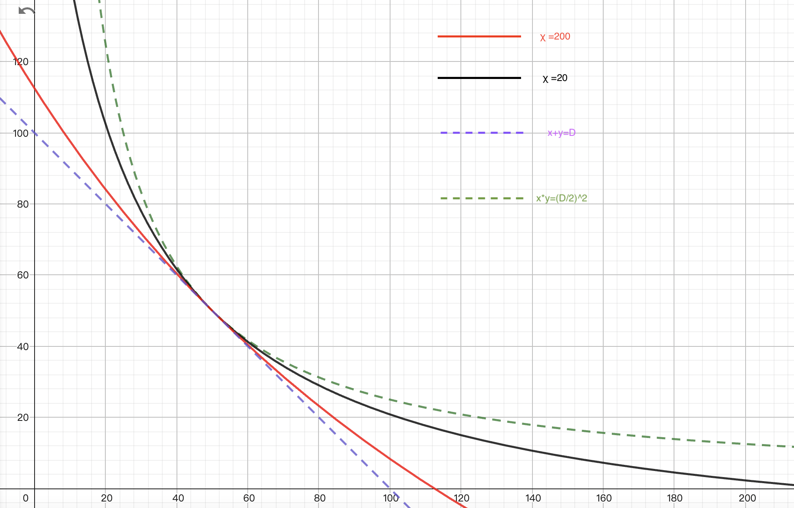
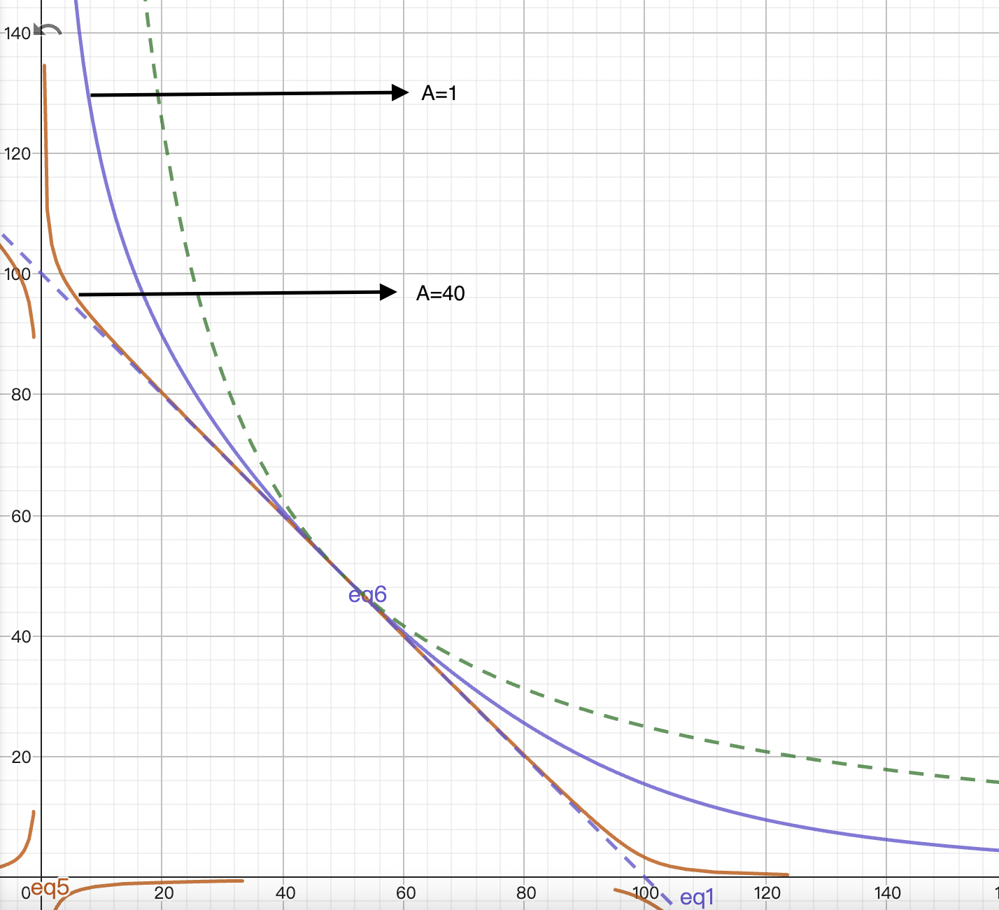
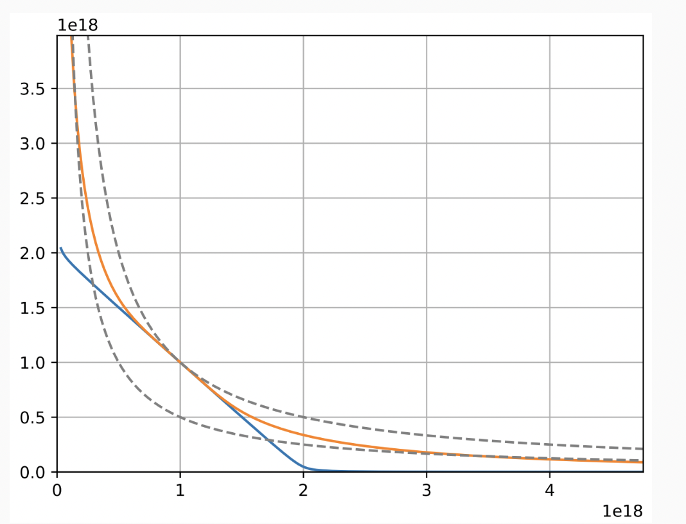

# 基本介绍

* Curve 主要解决的是市场中价格相对稳定的代币对交易需求，例如 USDT/USDC/DAI，stETH/WETH，这类代币对价格一般在上下 3% 波动。

* 而在 Uniswap 中交易有以下问题：

  * 交易带来的滑点：我们知道在 Uniswap 中每笔交易都会产生滑点，当交易数量过大，产生的滑点会超过代币对的差值，但是小额交易 Unswap 还是有市场的。
  * 交易手续费：Uniswap V3 最低支持 0.01% 的手续费。

* 所以我们需要一个价格滑点非常低的交易方法：恒定和做市商，公式如下

  * $$
    x+y=k
    $$

  * 其中 x，y 为池子中的代币数量，k 为不变量

  * 假设有一个代币对 USDT+USDC=x+y=100+100=200=k，如果用 10USDT 可以从池子中换出 10USDC，可以看出交易滑点为 0。
  * 但是当外部市场的代币出现价差时，市场中的套利者会很快将池子中另一边的代币兑换枯竭，例如当 USDT 价格上涨，套利者会通过 USDC 兑换 USDT，然后将 USDT 在其他交易平台卖出，获得利润。

* 从上述可以看出：

  * 恒定和做市商：
    * 缺点：会造成一边资金池的枯竭
    * 优点：滑点小
  * 恒定乘积做市商：
    * 缺点：滑点大
    * 优点：不会造成一边资金池的枯竭

* 所以 Curve 通过将 恒定和做市商 和 恒定乘积做市商 结合得出了自己的交易模型

# 模型设计

* 假设现在有一个双币池子 USDC\DAI，恒定和与恒定乘积如下：

  * $$
    x+y=D \\
    x*y=k
    $$

    

* 假设池子中 USDC\DAI 的数量相等，都为 D/2，可以得出：

  * $$
    x+y=D \\
    x*y=(\frac D 2)^2
    $$

    

* 假设两个恒等式的比值为 χ，恒定和在乘以D，使两式的因次皆为[数量×数量] ，在将两个恒等式相加，可得：

  * $$
    χ(x+y)+x*y=χD+(\frac D 2)^2
    $$

  * 可以从公式得出：

    * 当 χ ＝ 0，方程式退化回 恒定乘积
    * 当 χ ＝ ∞，方程式退化回 恒定和

  * 所以 χ  越大方程式越接近恒定和，流动性就越向价格附近聚集，滑点越小，可以根据公式绘制如下图形：

    * 

  * 但是越接近恒定和，越容易发生，因代币出现价差，导致池子中一边的代币兑换枯竭。所以希望这个曲线在远离价格点时，χ 变小，曲线向恒定积拟合，靠近价格点时，χ 变大，曲线向恒定和拟合（参考下图 A=40 曲线），所以可以得出以下公式：

    * $$
      χ =A \frac {xy} {(\frac D 2)^2}
      $$

    * 其中A为一个常数，当x=y=D/2时， χ 是一个常数，同时也是最大值，当偏离价格点， χ 变小，而且偏离的越远 χ 的值越小。

  * 在相加时，为了保持两式的因次皆为[数量×数量]，恒定和还要多乘一个D，再将 χ 带入，最终公式如下：

    * $$
      & A \frac {xy} {(\frac D 2)^2}D(x+y)+x*y=A \frac {xy} {(\frac D 2)^2}D^2+(\frac D 2)^2 \\
      \Rightarrow
      & A*2^2*(x+y)+D=A*D*2^2+ \frac {D^3} {2^2xy}\\
      \Rightarrow
      & An^n \sum_{}{}x^i+D=ADn^n+ \frac {D^{n+1}} {n^n\prod_{}{}x^i}
      $$
      
    * A是一个放大系数，指的是曲线在价格点附近的稳定程度，A 越大流动性越向价格点集中，滑点变小，A 越小流动性就会向价格点两边分散，滑点变大，由下图所示：

      * 

    * 初始 A 值由开发团队以历史币价回测，经模拟后决定最佳化的数值。而服务上线后则可分析实际资金使用率，再经由DAO 提案以调整A 值

    * A 值与币价的关系为：
    
      > approximately optimal A ~= 1 / stdev(prices)

# V2

* Curve V2 的目标是为了支持非稳定币资产对交易，它在 V1 的基础上构造了一个新的曲线：

  1. 拥有 V1 曲线在价格点附近聚集流动性的优点，并且能在偏离价格点时还能具有一定的流动性，实现对非稳定币交易的支持

  2. 可以根据价格的变化重新计算价格点，使流动性重新聚集在新的价格点附近

* 我们来看下图：

  * 
  * 蓝色曲线：Curve V1
  * 黄色曲线：Curve V2
  * 上方黑色虚线：x*y = (D/N)^N
  * 下方黑色虚线：x*y = γ * (D/N)^N

* 从上图可以看出 V2 曲线在价格点附近拟合 V1 曲线；在远离价格点时，为了保证一定的流动性，V2 曲线去拟合了下方恒定积曲线，为了满足要求，在 V1 公式上进行改造，新增变量，新增变量需要达到两个目的：

  1. 在价格点附近，那么这个变量在价格点附近影响小，值趋近一
  2. 在远离价格点时，影响变大，变大速度逐渐加快，并且曲线向下方恒定积曲线拟合

* 来看一下 V2 的公式：

  * $$
    & KD^{N-1}\sum{x_i}+\prod{x_i}=KD^N+(\frac{D}{N})^N \\
    & K_0=\frac{\prod{x_i}N^N}{D^N} \\
    & K=AK_0\frac{\gamma^2}{(\gamma+1-K_0)^2} \\
    & A*K_0=A\frac{\prod{x_i}N^N}{D^N}=\chi
    $$

  * 可以看出当处于价格点时 K_0=1，即 K=A，可以得出公式 Curve V2 表达式等于 Curve V1 表达式

    * $$
      & AD^{N-1}\sum{x_i}+\prod{x_i}=AD^N+(\frac{D}{N})^N \\
      & V1公式：\prod{x_i}= (\frac{D}{N})^N \\
      \Rightarrow
      & An^n \sum_{}{}x^i+D=ADn^n+ \frac {D^{n+1}} {n^n\prod_{}{}x^i}
      $$

  * 当远离价格点时，K_0 变小，直至 K_0=γ 时，与下方黑色虚线拟合

* 预言机和流动性再平衡：
  * V2 有一个内部预言机，称为**EMA（exponentially moving average）预言机**，是根据Curve的历史成交价以及最新的交易信息综合计算得出一种参考价格，当价格偏离价格点超过一定幅度时，便会自动对整条曲线的形状进行调整，使得流动性重新聚合于最新的交易价格附近。
  * 公式 todo

# 总结

* 可以看出 Curve 通过复杂的数学公式解决了 Uniswap LP 出现的流动性集中，价格区间，手续费等问题，实现了一种自动化解决方案，但是带来的也是复杂度大量提升，尤其是 V2 公式尤其多，让大家理解起来很困难

  

# 参考文章

* [深入浅出Curve Finance的自动化做市商（AMM）原理 - 知乎](https://zhuanlan.zhihu.com/p/461398413?source=post_page-----9cc5e391b0f2--------------------------------)
* [浅谈稳定币互换机制：从Balancer 到Curve. 稳定币为一种锚定法定货币价值的虚拟货币，可在这动荡的市场中作为相对可靠的避险资产… | by Ethan C. | Medium](https://medium.com/@cic.ethan/淺談穩定幣互換機制-從-balancer-到-curve-f638f29b33f9)
* [Curve V2方案解析：通用与定制化AMM之争 - MyToken](https://www.mytokencap.com/news/259191.html)
* [Buidler DAO：从A参数看Curve技术细节和治理理念 | Web3世界](https://www.web3sj.com/definews/82017/)
* [CryptoSwap - Curve Technical Docs](https://docs.curve.fi/references/whitepapers/cryptoswap/)
* [深度研究 | 逆向解构Curve V2](https://mp.weixin.qq.com/s/50E5t1O4cxipnBpaao8ZxQ)
* [Curve v2 CryptoSwap: white paper|Curve|white paper • 0xreviews.xyz](https://0xreviews.xyz/posts/2022-03-01-Curve-CryptoSwap-whitepaper/)
* [Dapp-Learning/defi/Curve-V2/readme.md at main · Dapp-Learning-DAO/Dapp-Learning · GitHub](https://github.com/Dapp-Learning-DAO/Dapp-Learning/blob/main/defi/Curve-V2/readme.md)
* [CurveCrypto (v2) Invariant | Desmos](https://www.desmos.com/calculator/vbhbicc7mw?lang=zh-CN)
