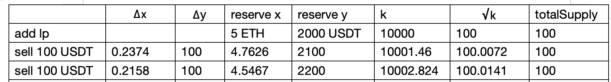
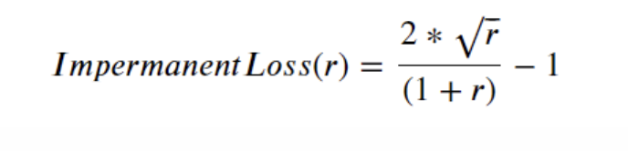
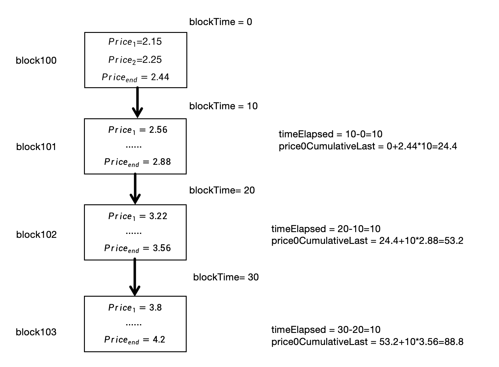
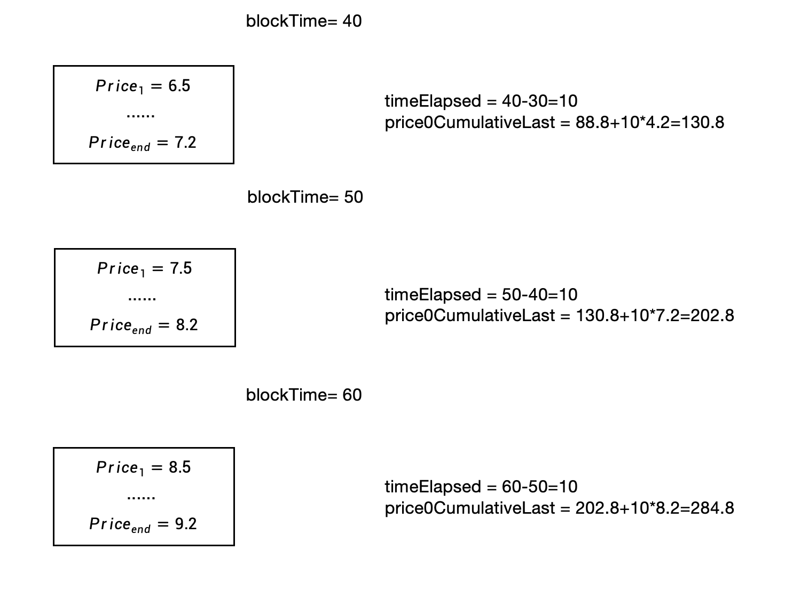
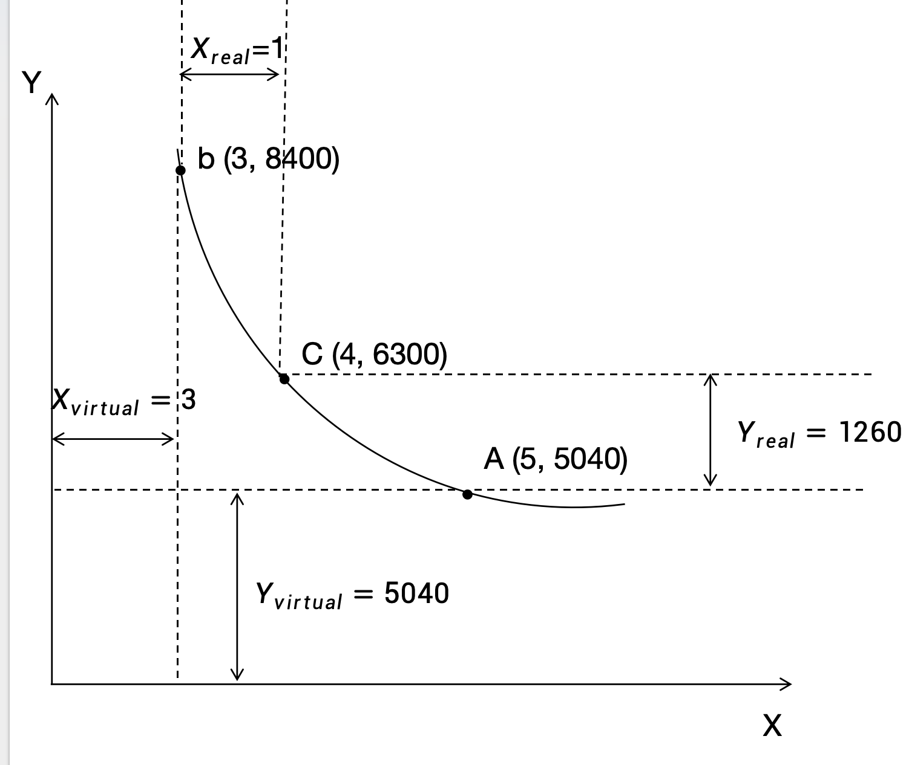
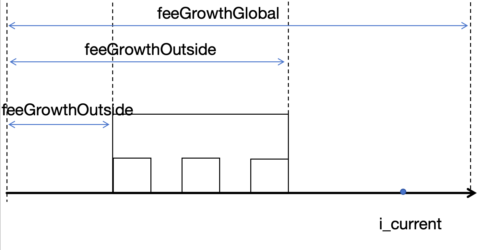
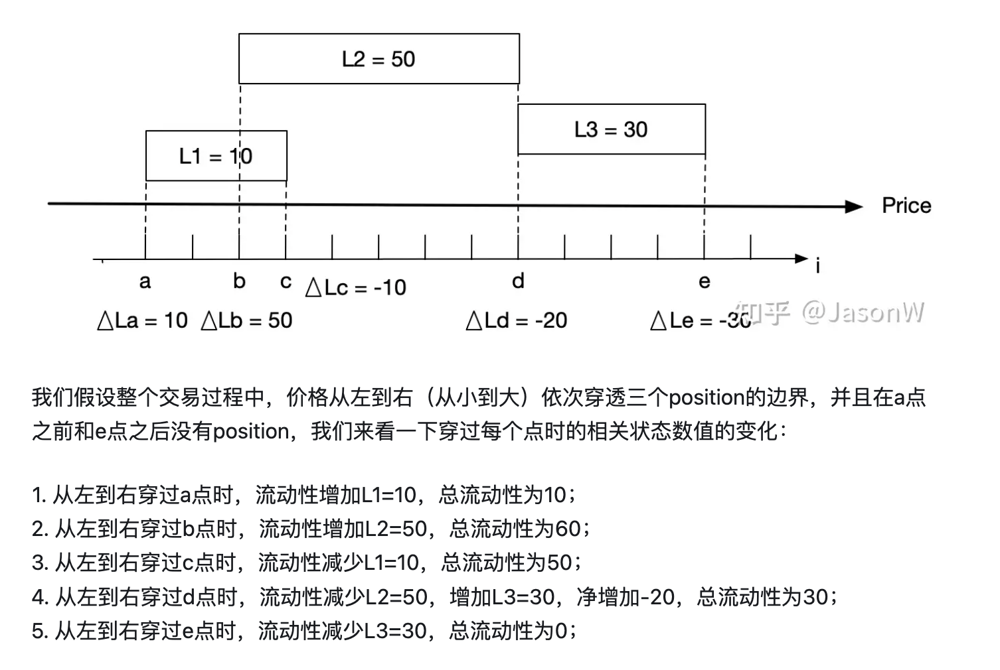

# Uniswap V2

## AMM自动做市商

* Uniswap 链上交易的基础叫恒定乘积做市商，它的核心就是一个公式： 

  * $$
    X*Y=K
    $$

  * 恒定乘积做市商的原理就是，在交易前后保证 K 值不变，其中 X和 Y 就是两种交易资产的数目，K为一个不变的数值。

  * 在交易时发生的公式如下：不考虑手续费

    * $$
      （x-\Delta	x）*(y+\Delta	y)=k
      $$

    * 举例说明，假设 tokenX=3，tokenY=100，K=300，我用 50个tokenY 去交易，经过如下计算，可以得到 1个tokenX

      * $$
        （3-tokenX）*（100+50）= 300\\
        							 tokenX = 1
        $$
      
        

## 流动性

* 在 Uniswap 中流动性就是恒定乘积做市商公式中 X和Y的数量，添加流动性就是增加X和Y的数量，移除流动性就是减少 X和Y的数量

* 在 uniswap v2中流动性计算代码如下：

  * 添加流动性：

    * ```solidity
      if (_totalSupply == 0) { 
          liquidity = Math.sqrt(amount0.mul(amount1)).sub(MINIMUM_LIQUIDITY);
      } else { 
          liquidity = Math.min(amount0.mul(_totalSupply) / _reserve0, amount1.mul(_totalSupply) / _reserve1);
      }
      ```

  * 移除流动性：

    * ```solidity
      uint _totalSupply = totalSupply; 
      amount0 = liquidity.mul(balance0) / _totalSupply; 
      amount1 = liquidity.mul(balance1) / _totalSupply; 
      ```

* **在下面我会举例说明以上公式如何计算**

  * 第一次添加流动性（初次添加，流动性 lp=0），amount0 = 4e，amount1 = 400u，那么

    * ```
      lp = sqrt(amount0 * amount1) = 40
      _reserve0 = amount0 = 4
      _reserve1 = amount1 = 400
      k = _reserve0 * _reserve1 = 1600
      totalSupply = lp = 40
      ```

  * 第二次添加流动性（非初次添加，流动性 lp>0），amount0 = 1e，amount1 = 100u，那么

    * ```
      lp = min(amount0/_reserve0*totalSupply, amount1/_reserve1*totalSupply) 
      	 = min(1/4*40, 100/400*40) = min(10, 10) = 10
      totalSupply = totalSupply + lp = 40 + 10 = 50
      _reserve0 = reserve0 + amount0 = 4 + 1 = 5
      _reserve1 = reserve1 + amount1 = 400 + 100 = 500
      ```

* **我们现在思考两个问题：**

  1. 我以异常的比例添加流动性会出现什么情况，比如现在池子价格为（1e，100u），高价添加（1e，160u）和低价添加（1e，80u）会出现什么情况呢？
  2. 计算 lp 为什么取最小值而不是最大值？

* 我们现在看第一个问题，异常的比例添加流动性会出现什么情况？

  * 高价添加（1e，160u）：

    * amount0 = 1e，amount1 = 160u，totalSupply = 50， _reserve0 = 5，_reserve1 = 500

    * ```
      lp = min(1/5*50, 160/500*50) = min(10, 16) = 10
      totalSupply = 50 + 10 = 60
      _reserve0 = 5 + 1 = 6
      _reserve1 = 500 + 160 = 660
      ```

    * 此时移除流动性，此人 lp = 10

      * ```
        amount0 = lp / totalSupply * _reserve0 = 10 / 60 * 6 = 1
        amount1 = lp / totalSupply * _reserve1 = 10 / 60 * 660 = 110
        ```

        * 可以看到移除流动性获得了 1e 和 110u，而其他 50u 作为惩罚平分给了其他lp提供者，所以在提供流动性时，需要合理范围内，否则就要承受损失

  * 低价添加（1e，80u）：

    * amount0 = 1e，amount1 = 80u，totalSupply = 50， _reserve0 = 5，_reserve1 = 500

    * ```
      lp = min(1/5*50, 80/500*50) = min(10, 8) = 8
      totalSupply = 50 + 8 = 58
      _reserve0 = 5 + 1 = 6
      _reserve1 = 500 + 80 = 580
      ```

    * 此时移除流动性

      * ```
        amount0 = lp / totalSupply * _reserve0 = 8 / 58 * 6 = 0.8275
        amount1 = lp / totalSupply * _reserve1 = 8 / 58 * 580 = 80
        ```

        * 可以看到移除流动性获得了 0.8275e 和 80u，而减少的 0.1724e 作为惩罚平分给了其他lp提供者，所以在提供流动性时，需要合理范围内

* 现在看第二个问题，lp 为什么取最小值而不是最大值，因为取最大值会破坏整个系统，额外获取不属于自己的利益

  * 高价添加（1e，160u）：

    * amount0 = 1e，amount1 = 160u，totalSupply = 50， _reserve0 = 5，_reserve1 = 500

      * ```
        lp = max(1/5*50, 160/500*50) = max(10, 16) = 16
        totalSupply = 50 + 16 = 66
        _reserve0 = 5 + 1 = 6
        _reserve1 = 500 + 160 = 660
        ```

      * 此时移除流动性

        * ```
          amount0 = lp / totalSupply * _reserve0 = 16 / 66 * 6 = 1.4545
          amount1 = lp / totalSupply * _reserve1 = 16 / 66 * 660 = 160
          ```

        * 可以看到移除流动性时拿到了 1.4545e 和 160u，额外获得不属于他的 0.4545e，

  * 低价添加（1e，80u）：

    * amount0 = 1e，amount1 = 80u，totalSupply = 50， _reserve0 = 5，_reserve1 = 500

    * ```
      lp = min(1/5*50, 80/500*50) = max(10, 8) = 10
      totalSupply = 50 + 10 = 60
      _reserve0 = 5 + 1 = 6
      _reserve1 = 500 + 80 = 580
      ```

      * 此时移除流动性，

        * ```
          amount0 = lp / totalSupply * _reserve0 = 10 / 60 * 6 = 1
          amount1 = lp / totalSupply * _reserve1 = 10 / 60 * 580 = 96.6666 
          ```

          * 可以看到移除流动性时拿到了 1e 和 96.6666u，额外获得不属于他的 16.6666u，


## 手续费

* 在Uniswap中交易是有手续费，每笔交易为 0.3%，默认全返还给流动性提供者，但是有一个开关可以控制其中1/6，也就是0.05%，是否给项目方。

* 在加入手续费后，新的公式如下所示：

  * $$
    \theta=1-\alpha
    $$

    

  * $$
    （x-\Delta	x）*(y+\theta\Delta	y)=k
    $$

* 现在我会举例说明该公式如何使用：

  * 假设现在有一个流动性池 ETH-USDT，其中池子比例为 ETH：USDT = 5：2000，现在通过两次花费100USDT来买入ETH，其中变量变化如下表格所示：

  * 

    * 第一次花费100USDT来买入ETH：

      * $$
        （5-x）*（200+10*0.997）= 5*200 \\
        									   x = 0.2374
        $$

    * 第二次花费100USDT来买入ETH：

      * $$
        （4.7626-x）*（2100+100*0.997）= 10001.46 \\
           													 x = 0.2158
        $$
    
  * 可以看到在 totalSupply（LP总量）不变的情况下，每一次交易，K值在增加，其中增加的就是手续费，这部分手续费会平分给所有流动性提供者，并在移除流动性时实现收益


## 滑点

* 我们以**上面**手续费计算为例子进行说明：
  * 我们知道流动性池 ETH：USDT = 5：2000，所以在此池子中 1ETH=400USDT
  * 而花费 100USDT，应该得到 0.25ETH，但是根据计算我们只得到了 0.2374ETH，其中的差值就是**滑点**，我们在 Uniswap Swap时，会显示的兑换数量是 0.2374 而不是 0.25，滑点为 5.04%

## 无常损失

* 我们还以手续费计算为例子进行说明：**（以下计算忽略手续费）**
  * 我们知道流动性池 ETH * USDT = 5 * 2000，所以在此池子中 1ETH=400USDT，假设小明拥有这个流动性池的20%，那么在此时他拥有 1ETH+400USDT
  * 现在假设ETH价格突然发生了大幅变化：
    * 假设此时 ETH 价格突然上涨400%，此时 1ETH=1600USDT，此时流动性池 ETH * USDT=2.5 * 4000，这时移除流动性，小明将获得 0.5ETH+800USDT=**1600USDT=1ETH**
      * 如果小明当时没有添加流动性池，而是一直持有 1ETH+400USDT，那么此时价值 **2000USDT或1.2ETH**
    * 假设此时 ETH 价格突然下跌75%，此时 1ETH=100USDT，此时流动性池 ETH：USDT = 10：1000，这时移除流动性，小明将获得 2ETH+200USDT=**400USDT=4ETH**
      * 如果小明当时没有添加流动性池，而是一直持有 1ETH+400USDT，那么此时价值 **500USDT或5ETH**
* 可以从上述计算看出无论价格上涨还是下跌，小明都要承受损失，这个就是**无常损失**，所以我们在添加流动性时需要考虑手续费收入能否覆盖代币价格波动带来的无常损失
* 计算公式：r 为价格比值

  * 

  	* 推导过程：https://myself659.github.io/post/blockchain/uniswap-impermanent-loss-formula/


## 价格预言机

* UniswapV2 使用的价格预言机称为 **TWAP（Time-Weighted Average Price）**，即**时间加权平均价格**，该累计价格将是此合约历史上每秒的现货价格之和。在每个区块第一笔交易前记录累计价格实现预言机，累计价格每个价格会以时间权重记录（基于当前区块与上一次更新价格的区块的时间差）。具体可看下图：

  * 
  * 

* 实现 TWAP 官方提供了两种方式：固定时间窗口，滑动时间窗口

  * **固定时间窗口：**假设窗口大小为 30

    * 我们只需取对应时间区间的两个累积价格，然后在除以时间间隔即可
    * 【0，30】：（88.8-0）/（30-0）= 2.96
      * 那么在【30，60】这段时间内，我们得到的价格都为 2.96
    * 【30，60】：（284.8-88.8）/（60-30）= 6.53
      * 那么在【60，90】这段时间内，我们得到的价格都为 6.53

  * **滑动时间窗口：**假设窗口 windowSize=30，分隔时间片段数量 granularity=3，间隔 periodSize=10

    * 我们在任意时间点 time 得到的价格：

      * **当前时间区间** 到 **第 time / periodSize % granularity 个时间区间**的加权平均价格

    * 例如：

      * 当前时间区间：【40，50】

      * 第 time / periodSize % granularity 个时间区间：

        * ```
           time / periodSize % granularity = 45 / 10 % 3 = 1
          ```

        * 也就是第一个时间区间【10，20】，所以可以得到价格为（130.8-24.4）/（40-10）= 3.54

      * 同理，如果当前时间区间为【30，40】，那么对应区间为第0个，为【10，20】，计算可得：

        * （88.8-0）/（30-0）= 2.96

* 能否操控价格？

  * 操纵这个价格会比操纵区块中任意时间点的价格要困难。如果攻击者通过在区块的最后阶段提交一笔交易来操纵价格，其他套利者（发现价格差异后）可以在同一区块中提交另一笔交易来将价格恢复正常。矿工（或者支付了足够gas费用填充整个区块的攻击者）可以在区块的末尾操控价格，但是除非他们同时挖出了下一个区块，否则他们没有特殊的优势可以进行套利。
  * 以太坊的POS选定矿工能否提前知道？提前知道就可以操控价格？

# Uniswap V3

* 以下主要介绍了 Unswap V3 与 Uniswap V2 的不同之处，主要在以下几方面进行了介绍：
  * 集中流动性
  * 添加移除流动性
  * tick
  * 手续费
  * 预言机
  * 无常损失


## 集中流动性

* 我们现在来看一个例子：假设在 uniswapV2 中一个流动性池为 ETH * USDT=4 * 6300（1ETH=1575USDT）
  * 当价格上升到 ETH * USDT=3 * 8400（1ETH=2800USDT），即池子减少 1ETH，也就是池子中只有 1ETH 参与了流动，余下3 ETH未参与流动，此时资金利用率为 (4-3)/4=0.25
  * 当价格下降到 ETH * USDT=5 * 5040（1ETH=1008USDT），即池子减少 1260USDT，也就是池子中只有 1260USDT 参与了流动，余下 3780USDT 未参与流动，此时资金利用率为 (6300-5040)/6300=0.2
* 根据如上例子我们可以看出：当 ETH 价格为 1575，并在【1008，2800】波动时，参与流动的只有 1ETH + 1260USDT，而其余 3ETH+5040USDT未参与流动，因此大部分资金都是处于无用状态，所以我们能否只提供参与流动的资金，也就是 1ETH + 1260USDT，而未参与流动的资金由程序虚拟出来呢？

* 答案是可以的，在 uniswapV3 中通过在指定价格区间提供流动性来虚拟资金，可以根据以上例子绘制一个图表：
  * 


​																								图 (1)

* 根据上图可以得出公式：

  * $$
    x=x_{real}+x_{virtual} \\    
    y=y_{real}+y_{virtual}
    $$

* 根据恒定乘积可以推导出：

  * $$
    \left\{
    \begin{aligned}
    & x*y=L^2 \\
    & P=\frac{y}{x} 
    \end{aligned}
    \right.
    \Rightarrow
    \left\{
    \begin{aligned}
    & x=\frac{L}{\sqrt{P}} \\
    & y=L*\sqrt{P} 
    \end{aligned}
    \right.
    \Rightarrow
    \left\{
    \begin{aligned}
    & \Delta x=\frac{\Delta L}{\Delta\sqrt{P}} \\
    & \Delta y=\Delta L*\Delta\sqrt{P} 
    \end{aligned}
    \right.
    $$

  * 经过计算可得：

    * $$
      L^2=4*6300=25200 \\
      P_b=8400/3=2800\\
      P_a=5040/5=1008
      $$

* 再由以上公式可得：

  * $$
    \begin{aligned}
    (x_{real}+x_{virtual})*(y_{real}+y_{virtual})=L^2 \\
    (x_{real}+\frac{L}{\sqrt{P_b}})*(y_{real}+L*\sqrt{P_a})=L^2 
    \end{aligned}
    $$

* 当价格来由 c->b 点时，将消耗 1ETH，真实流动性 X_real=0，被耗尽，此时：

  * $$
    X=X_{virtual}=\frac{L}{\sqrt{P_{b}}}=3 \\
    $$

* 当价格来由 c->a 点时，将消耗 1260USDT，真实流动性 Y_real=0，被耗尽，此时：

  * $$
    Y=Y_{virtual}={L}*{\sqrt{P_{a}}}=5040
    $$

* 所以在 c 点时：

  * $$
    \left\{
    \begin{aligned}
    &(x_{real}+3)*(y_{real}+5040)=25200 \\
    &\frac{y_{real}+5040}{x_{real}+3}=1575
    \end{aligned}
    \right .
    \Rightarrow
    \left\{
    \begin{aligned}
    &x_{real}=1 \\
    &y_{real}=1260
    \end{aligned}
    \right .
    $$

* 在 b 点时：

  * $$
    \left\{
    \begin{aligned}
    &(0+3)*(y_{real}+5040)=25200 \\
    & x_{real}=0
    \end{aligned}
    \right .
    \Rightarrow
    \left\{
    \begin{aligned}
    &x_{real}=0 \\
    &y_{real}=3360
    \end{aligned}
    \right .
    $$

    

* 在 a 点时：

  * $$
    \left\{
    \begin{aligned}
    &(x_{real}+3)*(0+5040)=25200 \\
    & y_{real}=0
    \end{aligned}
    \right .
    \Rightarrow
    \left\{
    \begin{aligned}
    &x_{real}=2 \\
    &y_{real}=0
    \end{aligned}
    \right .
    $$


* ## 添加移除流动性

  * 在添加移除流动性时需要指定position，也就是价格区间【a，b】，所以在当前价格 P 和 价格区间position又有以下几种关系：**以下关系可参考 图 (1)**

    * P 在 position 内，p>a && p<b
    * P 大于 position，p>b
    * P小于 position，p<a

  * P 在 position 内：

    * 我们知道公式：
      $$
      & \Delta x=\frac{\Delta L}{\Delta\sqrt{P}} \\
      & \Delta y=\Delta L*\Delta\sqrt{P}
      $$

    * $$
      \left\{
      \begin{aligned}
      & \Delta x=\Delta L*(\frac{1}{\sqrt{P_b}}-\frac{1}{\sqrt{P_c}})  \\
      & \Delta y=\Delta L* (\sqrt{P_c}-\sqrt{P_a}) \\
      \end{aligned}
      \right.
      \Rightarrow
      
      \Delta L =\Delta x*\frac{\sqrt{P_c}*\sqrt{P_b}}{\sqrt{P_b}-\sqrt{P_c}}
      =\frac{\Delta y}{\sqrt{P_c}-\sqrt{P_a}}
      $$

    * 取两者最小值即可

  * P 大于 position：此时流动性全都由 y 组成

    * $$
      \Delta L =\frac{\Delta y}{\sqrt{P_b}-\sqrt{P_a}}
      $$

      

  * P 小于 position：此时流动性全都由 x 组成

    * $$
      \Delta L =\Delta x*\frac{\sqrt{P_a}*\sqrt{P_b}}{\sqrt{P_b}-\sqrt{P_a}}
      $$

      

## Tick

* 在 UniswapV3 中价格被分为了不同区间，价格与 tick 之间的关系可用以下公式表示：

  * $$
    P(i)=1.0001^i
    $$

  * 其中 i 是一个 `int24` 类型（**有符号**）

* 通过 tick 可以得到不同的价格区间 position，每个 position 都有两个变量 tick_lower和tick_upper

* 对于 tick 和 positon 需要注意以下几点

  * UniswapV3 中的价格是由系统定义好的，无法自定义
  * 每个 tick 的流动性是不同的，也就是 k 值不同，所以在跨越 tick 时，流动性会发生改变
  * 每个 positon 可以包含多个 tick
  * 不同的position可以共用同一个tick

* tick 和 position 的关系可以可看下图：

  * 

## 手续费

* 交易费率：

  * 在 uniswapV2 手续费固定为 0.3%，但是对于某些价格比较稳定的交易对 USDT/USDC，WETH/WBTC，这个交易手续费就太高了， V3 对于每一种交易对，都提供了几档可选费率等级 0.01%，0.05%, 0.3%, 1%，后续可以通过社区投票新增

* tickspace：

  * 对于价格波动大的交易对，可以设置较大的交易费率，由于价格波动较大，就不适合提供过于密集的价格区间；价格波动较小的交易对，可以设置较小的交易费率，由于价格波动较小，就不适合提供过于稀疏的价格区间。

  * 所以对于每种交易费率都提供了不同的 tickspacing，就是 tick 之间需要间隔多少个才是有效的可使用的 tick

  * 其中 V3 设定的费率等级**tickspacing**之间的关系如下：

    * | 费率  | tickspacing | 建议的使用范围   |
      | ----- | ----------- | ---------------- |
      | 0.05% | 10          | 稳定币交易对     |
      | 0.3%  | 60          | 适用大多数交易对 |
      | 1%    | 200         | 波动极大的交易对 |
      | 0.01% | 1           |                  |

* 手续费：

  * 手续费来源其实就是，用户输入的代币在不同的 tick 消耗的数量，那么，我们如何记录手续费呢？

  * 如果我们通过在 tick 上记录积累手续费的数量进行记录，那么用户在提取手续费时，需要遍历用户 position 下的所有 tick，然后进行手续费进行汇总，这个方式没错，但是如果 tick 很多的话，那么遍历 tick 会很消耗 gas

  * V3 是通过记录 **区间外侧手续费** 和 **全局手续费**来计算的

    * feeGrowthGlobal(全局手续费)：**每单位**流动性积累的手续费总量
    * feeGrowthOutside(区间外侧手续费)：远离当前价格一侧的**每单位**流动性手续费总量
      * 

    * 注意：当穿越 tick 时，feeGrowthOutside 需要翻转为另一侧的值，即：
      *  feeGrowthGlobal - feeGrowthOutside

  * 当用户提取手续费或者添加移除流动性时，手续费才会分配到具体的 position上

    * 首先需要维护上一次 用户提取手续费或者添加移除流动性时的手续费大小，然后在算出当前每单位流动性手续费大小，其中差值就是这段时间产生的手续费，累积到对应用户上就可以。


## 预言机

* 价格预言机：

  * Uniswap V3 使用的是时间累积的几何平均数，相比于 Uniswap V2 的算术平均数，几何平均数有受极端值影响较小的优点，而且几何平均数只需记录一个 token0 的价格，另一个 token1 和 token0 互为倒数

  * 计算公式如下：

    * $$
      a_t=\sum_{i=0}^{t} \log_{1.0001} p_i
      $$

    * 可以看出 而 V3 累加的是 `log(p_i, 1.0001)` 也就是价格的幂，使用时再除以时间间隔

  * 当用户使用时，通过计算 t1 到 t2 两个时间点累积的差值，在除以时间即可：

    * $$
      a_{t2}-a_{t1}= \frac {\textstyle \sum_{i=t_1}^{t_2} \log_{1.0001}p_{t_2,t_1}} {t_2-t_1} 
      \Rightarrow \\
      p_{t_2,t_1}=1.0001^{\frac {a_{t2}-a_{t1}} {t_2-t_1}}
      $$

  * Uniswap V3 中使用一个大小为 65535 的数组去保存历史累积价格

* 流动性预言机：

  * 计算方式与价格机一致，只不过是累积流动性倒数L分之一：

    * $$
      a_t=\sum_{i=0}^{t} \frac 1 L_i
      $$

  * 我们知道了，在一段时间间隔内，某个交易对的流动性大小，应用？

    

## 无常损失

* Uniswap V3 引入了虚拟流动性的概念，相当于放大了我们的使用资金，所以无常损失应该比 Uniswap V2 更大才对。

* 我们现在来看一个例子：假设有一个流动性池为 ETH * USDT=4 * 6300（1ETH=1575USDT）

  * 在 Unswap V2 中当价格上升到 ETH * USDT=3 * 8400（1ETH=2800USDT），无常损失为：

    * ```
      （6300+4*2800）-（8400*2）/（6300+4*2800）= 0.04
      ```

  * 在 Uniswap V3 中我们需要先计算真实流动性大小：

    * 初始状态：x_real = 1，y_real = 1260
    * 价格上升后：x_real = 0，y_real =3360

  * 无常损失为：

    * ```
      （1*2800+1260）-3360/（1*2800+1260）= 0.1724
      ```

      

  * 在 Unswap V2 中当价格下降到 ETH * USDT=5 * 5040（1ETH=1008USDT），无常损失为：

    * ```
      （6300+4*1008）-（5040*2）/（6300+4*1008）= 0.0244
      ```

  *  在 Uniswap V3 中我们需要先计算真实流动性大小：

    * 初始状态：x_real = 1，y_real = 1260
    * 价格下降后：x_real = 2，y_real =0

  * 无常损失为：

    * ```
      （1*1008+1260）-2*1008/（1*1008+1260）= 0.1111
      ```

* 由上述计算可看出，Uniswap V3 无常损失会更大


# 参考

* [Uniswap V3 Contract Analysis | Blog](https://blog.web3idea.xyz/post/blockchain%2Fdefi%2FUniswap-v3合约分析)
* [Uniswap V2里的手续费换算_uniswap 买入卖出费率-CSDN博客](https://blog.csdn.net/sanqima/article/details/109667469)
* [UniswapV2公式推导 - 知乎](https://zhuanlan.zhihu.com/p/400448204)
* [深入分析AMM恒定乘积模型的滑点与无常损失](https://www.jinse.cn/news/blockchain/1054106.html)
* [无常损失解释 | 币安学院](https://academy.binance.com/en/articles/impermanent-loss-explained)
* [交易市场简介 | Uniswap V3 Book 中文版](https://y1cunhui.github.io/uniswapV3-book-zh-cn/docs/introduction/introduction-to-markets/)
* [DeFi:Uniswap v2协议原理解析一.什么是Uniswap v2 Uniswap是基于以太坊上的去中心化交易所， - 掘金](https://juejin.cn/post/7178857641421045820#heading-12)
* [价格预言机的使用总结（二）：UniswapV2篇-腾讯云开发者社区-腾讯云](https://cloud.tencent.com/developer/article/2017546)
* [Uniswap v3 设计详解 - 知乎](https://zhuanlan.zhihu.com/p/448382469)
* [[科普\]由浅入深理解UniswapV3白皮书 | 登链社区 | 区块链技术社区](https://learnblockchain.cn/article/3055)
* [uniswap的非永久性损失公式的推导 - 沉风网事](https://myself659.github.io/post/blockchain/uniswap-impermanent-loss-formula/)
* [深入理解 Uniswap v2 白皮书 — AdamShao](https://mirror.xyz/adshao.eth/qmzSfrOB8s6_-s1AsflYNqEkTynShdpBE0EliqjGC1U)
* [UniswapV2代码详解. Uniswap… | by Hakeen｜头等仓 | Medium](https://medium.com/@yhk15802841343/uniswapv2代码详解-d3c847682c91)
* [Uniswap V2 core源码解析Uniswap V2合约分为核心合约（core）和周边合约（periphery）， - 掘金](https://juejin.cn/post/7185379590162874429)
* [深入解读 Uniswap v3 新特性-腾讯云开发者社区-腾讯云](https://cloud.tencent.com/developer/article/2207603)
* [165. Uniswap v3 无常损失分析 - Qiwihui's blog](https://qiwihui.com/blogs/qiwihui-blog-165.html#google_vignette)
* [[科普\]由浅入深理解UniswapV3白皮书 | 登链社区 | 区块链技术社区](https://learnblockchain.cn/article/3055#资金利用率)
* [深入理解 Uniswap v3 白皮书 — AdamShao](https://mirror.xyz/adshao.eth/tgZjDXOtL999iuPjXWrolR7Ns1nTZDADA6NLJaJpJJM)
* [去中心化金融笔记](https://dune-marten-78b.notion.site/85b1d29c86344112a886fcfb2ea1c44c#90d13877ee5d4c9e8293f3d7ffacf78f)
* [UniSwapV3速通：白皮书](

